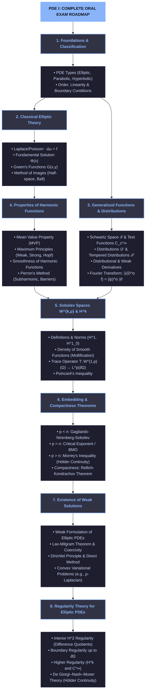

```mermaid
flowchart TD
    %% Styling
    classDef default fill:#1e1e2e,stroke:#cdd6f4,stroke-width:1px,color:#cdd6f4;
    classDef mainHeader fill:#89b4fa,stroke:#89b4fa,color:#11111b,font-weight:bold;
    classDef sectionHeader fill:#313244,stroke:#89b4fa,stroke-width:2px,color:#89b4fa,font-weight:bold;

    TITLE["<b>PDE I: COMPLETE ORAL EXAM ROADMAP</b>"]:::mainHeader

    %% Phase 1
    P1["<b>1. Foundations & Classification</b>"]:::sectionHeader
    P1_1["• PDE Types (Elliptic, Parabolic, Hyperbolic)<br>• Order, Linearity & Boundary Conditions"]

    %% Phase 2
    P2["<b>2. Classical Elliptic Theory</b>"]:::sectionHeader
    P2_1["• Laplace/Poisson: -Δu = f<br>• Fundamental Solution Φ(x)<br>• Green's Functions G(x,y)<br>• Method of Images (Half-space, Ball)"]

    %% Phase 3
    P3["<b>3. Generalized Functions & Distributions</b>"]:::sectionHeader
    P3_1["• Schwartz Space 𝒮 & Test Functions C_c^∞<br>• Distributions 𝒟' & Tempered Distributions 𝒮'<br>• Distributional & Weak Derivatives<br>• Fourier Transform: 𝔉(D^α f) = (ip)^α 𝔉f"]

    %% Phase 4
    P4["<b>4. Properties of Harmonic Functions</b>"]:::sectionHeader
    P4_1["• Mean Value Property (MVP)<br>• Maximum Principles (Weak, Strong, Hopf)<br>• Smoothness of Harmonic Functions<br>• Perron's Method (Subharmonic, Barriers)"]

    %% Phase 5
    P5["<b>5. Sobolev Spaces W^{k,p} & H^k</b>"]:::sectionHeader
    P5_1["• Definitions & Norms (H^1, H^1_0)<br>• Density of Smooth Functions (Mollification)<br>• Trace Operator T: W^{1,p}(Ω) → L^p(∂Ω)<br>• Poincaré's Inequality"]

    %% Phase 6
    P6["<b>6. Embedding & Compactness Theorems</b>"]:::sectionHeader
    P6_1["• p < n: Gagliardo-Nirenberg-Sobolev<br>• p = n: Critical Exponent / BMO<br>• p > n: Morrey's Inequality (Hölder Continuity)<br>• Compactness: Rellich-Kondrachov Theorem"]

    %% Phase 7
    P7["<b>7. Existence of Weak Solutions</b>"]:::sectionHeader
    P7_1["• Weak Formulation of Elliptic PDEs<br>• Lax-Milgram Theorem & Coercivity<br>• Dirichlet Principle & Direct Method<br>• Convex Variational Problems (e.g., p-Laplacian)"]

    %% Phase 8
    P8["<b>8. Regularity Theory for Elliptic PDEs</b>"]:::sectionHeader
    P8_1["• Interior H^2 Regularity (Difference Quotients)<br>• Boundary Regularity up to ∂Ω<br>• Higher Regularity (H^k and C^∞)<br>• De Giorgi–Nash–Moser Theory (Hölder Continuity)"]

    %% Graph Connections
    TITLE --> P1
    P1 --> P1_1

    P1_1 --> P2
    P1_1 --> P3

    P2 --> P2_1
    P3 --> P3_1

    P2_1 --> P4
    P4 --> P4_1

    P4_1 --> P5
    P3_1 --> P5

    P5 --> P5_1
    P5_1 --> P6
    P6 --> P6_1

    P6_1 --> P7
    P7 --> P7_1

    P7_1 --> P8
    P8 --> P8_1
```