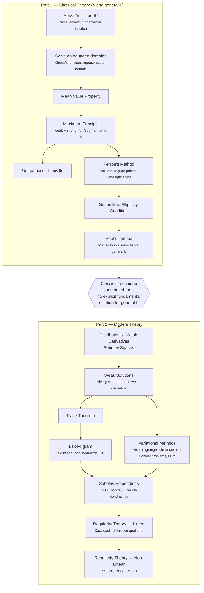

# Overview

# Existence Methods for Elliptic PDEs — Course Overview

| Method | Domain / hypotheses | Idea | What it gives you |
|---|---|---|---|
| **1. Explicit construction** (fundamental solution, Green's function)  | $\Delta$ only, $\Omega$ "nice" (mirror trick / reflection works) | Build $\Gamma$ radially, correct with a harmonic $h$ to force $G=0$ on $\partial\Omega$, integrate against data | An actual formula for $u$ — the strongest possible result, but only on domains where the correction $h$ is explicitly solvable |
| **2. Perron's method**  | $\Delta$ only, but *any* bounded domain (given regular boundary) | Take the sup of all subharmonic functions below the boundary data; show the sup is itself harmonic (via local harmonic lifts) and matches the boundary data at regular points | Existence with **no explicit formula** — trades constructiveness for generality of domain |
| **3. Lax–Milgram**  | General elliptic $L$ (divergence form), linear, **no symmetry needed** | Weak formulation is a bounded, coercive bilinear form on $H_0^1$; Riesz representation + coercivity give existence and uniqueness directly | Existence for *any* linear elliptic problem — most general of the "modern" methods, but linear only |
| **4. Dirichlet principle / Direct method** | General elliptic $L$, but needs **symmetric** bilinear form | Recast the PDE as minimizing an energy functional; coercivity + lower semicontinuity + weak compactness of a minimizing sequence give a minimizer, whose Euler–Lagrange equation is the PDE | Same conclusion as Lax–Milgram for the symmetric case, but the method itself generalizes further (see below) |
| **5. Convex variational methods** | Convex (not necessarily quadratic) functionals, so genuinely **nonlinear** PDEs | Same direct-method skeleton as (4), but with a general convex functional instead of a quadratic energy — lower semicontinuity now needs convexity instead of linearity | The only method here that reaches nonlinear elliptic problems |

## Supporting machinery (not existence methods themselves)

- **Sobolev embeddings** (GNS, Morrey, Rellich–Kondrachov) — feed the compactness step inside methods 4/5, and the boundedness step inside method 3's coercivity estimates (Poincaré).
- **Regularity theory** (Cacciopoli, difference quotients, Moser, De Giorgi–Nash) — no existence content; a postprocessing step applied *after* methods 3/4/5 already produced a weak solution, to upgrade its smoothness.
- **Hopf's Lemma / general max principle** — no existence content either; supplies uniqueness and a priori bounds. In a fuller course this would feed a sixth method (method of continuity), but that route isn't developed as its own chapter here — the classical path to existence for general $L$ is left as the gap that motivates the weak-solution methods instead.

## Exam framing
"Classical theory" → methods 1–2.
"How modern approaches show existence" → methods 3–5.
Five short paragraphs total — know the *idea* of each cold; treat the supporting lemmas (Rellich–Kondrachov proof, Moser iteration algebra, etc.) with the tedium tiering from before.

# Classical Elliptic PDE Theory

> [!NOTE]
> Motivation for the first two sections: The Laplace/Poisson Equation is the simplest form of a second order elliptic PDE. Thus it is natural to try to solve it - if possible explictly - first.

## Constructing Solutions to the Poisson Equation
### Solving the Poisson Equation on $\R^n$
#### Solving the Laplace Equation for radially symmetric functions
#### Solving the Poisson Equation for a point source
> [!TIP]
> The Laplace Equation 
> $$\Delta\Phi = 0$$ 
> literally means that $\Phi$ is in a **harmonic**, "peaceful" state. We want to find out, how $\Phi$ responds, if a single, concentrated source **disturbs** this peace. Formally, we want to solve
> $$- \Delta\Phi = \delta,$$
> where $\delta$ is a "point source"

> [!NOTE]
> To make sense of this "point source", we need just a bit of distribution theory now.
> - A ***test function*** $\psi$
>   is smooth and compactly supported.
> - The "point source" itself will be the ***Dirac Distribution*** **$\delta$.** It acts on a test function by evaluating it at 0: 
>   $$\delta(\psi) := \psi(0).$$ 
> - When we write 
>   "$-\Delta\Phi = \delta$", it actually means 
>   $$ -\int_{\mathbb{R}^n} \Phi \,   \Delta\psi \, dx = \delta(\psi)$$
>   for ***every*** test function $\psi$. 
 
> [!TIP] 
> To make more sense of this without getting too deep into Distribution Theory:
>  If $\Phi$ is smooth, Green's second Identity allows us to swap the Laplacian over. Then both sides of the above definition are *linear functionals* acting on the same test function. Bottom Line is: We **determine** the behavior of $\Phi$ **by** determining its behavior on *all* **test functions**.

#### Deriving a Solution for arbitrary $f$ (still on $\R^n$)
#### Short "honorable mention" of Fourier Transform
>[!NOTE]
> The Fourier Transform yields an alternative way to derive the constants for the fundamental solutions.

### Solving the Poisson Equation on (nice) bounded domains
#### Correcting the $\R^n$ solution to fit boundary conditions (Green's Functions)
#### Green's Representation Formula

> [!TIP]
> We will see that these solutions are unique in just a bit using the *Maximum Principle* for harmonic functions.

---

> [!NOTE]
> Motivation for the other Chapters: Even though we just got an explicit formula to solve one of the most important PDEs, it only works on "nice" domains where something like the mirror-trick works. 
> It's hard to find solutions in general.
> Therefore, the following sections mainly focus on uniqueness and  existence in more arbitrary settings without constructing explicit solutions.

## (Sub-)Harmonic Functions
>[!NOTE]
> This section is about finding more general but non-constructive solutions to Laplace's Equation by investigating properties of harmonic functions.
### Mean Value Property
### Maximum Principles
#### The Weak Maximum Principle
#### The Strong Maximum Principle
### Uniqueness of Solutions
### Liouville's Theorem
### Perron's Method
> [!TIP]
> Perron's method answers the question raised earlier about existence on domains
> without an explicit Green's function.
#### Barriers
#### Regular Points
#### Lebesgue-Spine

---
>[!NOTE] 
> Now we move from the Laplace-Operator to more general  Second-Order Elliptic Operators.
> [!TIP]
> We will see that under the right assumptions, the Maximum Principle  still holds in the general setting. But we can no longer rely on the Mean Value Property. We need *Hopf's Lemma* to replace it in the argument.
---
## General Second-Order Elliptic Operators
### The Ellipticity Condition
### Generalized Maximum Principles
#### Hopf's Lemma

---
> [!IMPORTANT]
> Hopf's Lemma shows the Maximum Principle survives for
> general elliptic operators — so we still get uniqueness and a priori
> bounds for free. But existence is a different story: without an
> explicit fundamental solution or Poisson kernel, we have no
> constructive way to build solutions on even a small ball anymore.
> **Classical technique has run out of fuel** — not because the Maximum
> Principle failed, but because nothing is left to constructively build
> a solution with. This is what forces the shift to ***weak solutions***.
---
# Modern Elliptic PDE Theory
> [!NOTE]
> In order to find more solutions, one needs to be "less strict about the niceness" of the functions that solve a PDE at hand. Modern PDE Theory therefore weakened the notion of a solution by introducing a weaker sense of the derivative, yielding a new function space one can look for (and find more) solutions in.

> [!TIP]
> We will see later that often times one can find out that a weak solution "is not as bad after all". So the modern logic goes like this:
> 1. Look for a weak solution first as they are easier to find
> 2. Show that this weak solution is actually better behaved, more *regular*, than "expected".
> This part of the theory is called ***Regularity Theory***.

## Generalized Solutions
### Distributions
### Weak Derivatives
### Sobolev Spaces
### Weak Solutions
#### Divergence Form
> [!IMPORTANT]
> Though we are considering *Second-Order* Elliptic Operators, Integration By Parts using *Divergence-Form* allows us to look for solutions having only *one* Weak Derivative.
> (Regularity Theory will give us the second derivative back later)
### How to evaluate Sobolev Functions boundary (Trace Theorem)
### Existence via Lax-Milgram

## Variational Approaches / Dirichlet Principle
> [!TIP]
> Lax-Milgram already gave us existence and it did not even require symmetry — so why bother with an energy functional? 
> Because Variational Approaches are not restricted to linear problems!
### Euler-Lagrange Equation
### Direct Method Of Variations
### Convex Variational Problems
### Finite Element Method

## Sobolev Embeddings
### Gagliardo-Nirenberg-Sobolev Inequality
### Morrey Inequality
### Rellich-Kondrachov

## Regularity Theory
### Linear
#### Cacciopoli
#### Nirenberg Difference Quotients
### Non-Linear
#### De Giorgi-Nash
#### Moser Iteration

---
---
# Exam Prep Priority Queue — Tiered by Relevance × Low Tedium

## Tier S — cheap and central, do these first
| Topic | Why high-value | Tedium |
|---|---|---|
| Fundamental solution derivation (radial ODE + flux constant) | Core focus area; already deeply internalized | Low — one clean computation |
| $-\Delta\Gamma=\delta_y$ via Green's second identity + excised ball | Same — already built real intuition here | Low–medium, short once you know the trick |
| MVP → strong max principle → weak max principle chain | Two-line proofs each, high narrative payoff | Very low |
| Uniqueness / Liouville as corollaries | One line each, cheap to state | Trivial |
| Hopf's Lemma idea (barrier function + comparison) | Named focus area, genuinely short — one auxiliary function, one comparison argument | Low–medium |
| GNS exponent via scaling argument | Two lines, elegant, shows real understanding without memorization | Very low |

## Tier A — worth the proof, moderate cost
| Topic | Why | Tedium |
|---|---|---|
| Green's representation formula | Reuses the excise-a-ball + Green's 2nd identity trick already known, just on a bounded domain with an extra boundary integral | Medium — bookkeeping with two boundary pieces (∂Ω and ∂Bε), but structurally nothing new |
| Green's function existence for the ball (reflection / method of images) | Classic, concrete, satisfying to derive once | Medium — mostly algebra (inversion point $y^*=R^2y/\lvert y\rvert^2$) |
| Cacciopoli inequality | Short — one cutoff-function test in the weak formulation | Low |
| Difference-quotient idea (uniform $L^2$ bound ⇒ weak derivative exists) | Already sketched correctly; leans on known FA fact | Low (for this background) |

## Tier B — know statement + one-paragraph idea, skip full proof
| Topic | Why demote | Tedium if attempted |
|---|---|---|
| Green's function **symmetry** theorem | Two excised balls, careful sign tracking on normals, asymptotic expansion of Γ and ∇Γ near each singularity — high effort, modest conceptual payoff | High |
| Moser iteration full computation | Idea is the goal; actual iteration (testing with $u^{2\beta-1}\eta^2$, Sobolev embedding, induction over $\beta_k\to\infty$) is long and unenlightening to reproduce live | High |
| Rellich–Kondrachov proof | Needs Arzelà–Ascoli + covering/extraction argument — mechanically standard but long-winded, low payoff beyond "compactness via equicontinuity" | High |
| Perron's method full construction (harmonic lift existence, sup-is-harmonic argument) | Conceptually rich but has several fiddly lemmas (lift is subharmonic, sup doesn't decrease, local harmonicity via covering argument). State the *idea*, skip the lemma chain | High |
| Barriers / regular points / exterior sphere condition | Good to know *what* they are and *why* Lebesgue's spine is a counterexample; the regularity-criterion proofs are case-heavy | Medium–high |

## Tier C — statement only, no proof attempt needed
- Trace theorem (accept "continuous extension of a density argument" without reproducing it)
- Lax–Milgram (state coercivity + boundedness precisely; proof already natural from FA)
- Morrey's inequality statement (proof — Hölder estimate via integrating along a cone — is fiddly for the payoff)
- Convex variational problems / lower semicontinuity lemmas (mechanically similar to known FA-style direct method arguments — trust intuition, don't grind lemma numbers)

---

**Ordering for five days**: Tier S first (cheap, matches stated focus) → Tier A next (reuses techniques from Tier S, so marginal cost is lower than it looks) → Tier B and C as read-and-narrate only (full credit for "what it says and why it's needed," without the risk of blanking mid-proof on something fiddly with low payoff even when reproduced correctly).

