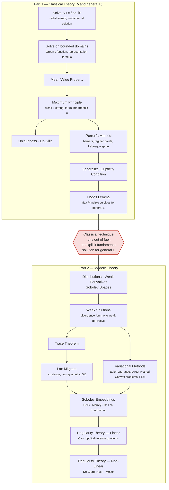

# Overview

# Classical Elliptic PDE Theory

> [!NOTE]
> Motivation for the first two sections: The Laplace/Poisson Equation is the simplest form of a second order elliptic PDE. Thus it is natural to try to solve it - if possible explictly - first.

## Constructing Solutions to the Poisson Equation
### Solving the Poisson Equation on $\R^n$
#### Solving the Laplace Equation for radially symmetric functions
#### Solving the Poisson Equation for a point source
> [!TIP]
> The Laplace Equation 
> $$\Delta\Phi = 0$$ 
> literally means that $\Phi$ is in a **harmonic**, "peaceful" state. We want to find out, how $\Phi$ responds, if a single, concentrated source **disturbs** this peace. Formally, we want to solve
> $$- \Delta\Phi = \delta,$$
> where $\delta$ is a "point source"

> [!NOTE]
> To make sense of this "point source", we need just a bit of distribution theory now.
> - A ***test function*** $\psi$
>   is smooth and compactly supported.
> - The "point source" itself will be the ***Dirac Distribution*** **$\delta$.** It acts on a test function by evaluating it at 0: 
>   $$\delta(\psi) := \psi(0).$$ 
> - When we write 
>   "$-\Delta\Phi = \delta$", it actually means 
>   $$ -\int_{\mathbb{R}^n} \Phi \,   \Delta\psi \, dx = \delta(\psi)$$
>   for ***every*** test function $\psi$. 
 
> [!TIP] 
> To make more sense of this without getting too deep into Distribution Theory:
>  If $\Phi$ is smooth, Green's second Identity allows us to swap the Laplacian over. Then both sides of the above definition are *linear functionals* acting on the same test function. Bottom Line is: We **determine** the behavior of $\Phi$ **by** determining its behavior on *all* **test functions**.

#### Deriving a Solution for arbitrary $f$ (still on $\R^n$)
#### Short "honorable mention" of Fourier Transform
>[!NOTE]
> The Fourier Transform yields an alternative way to derive the constants for the fundamental solutions.

### Solving the Poisson Equation on (nice) bounded domains
#### Correcting the $\R^n$ solution to fit boundary conditions (Green's Functions)
#### Green's Representation Formula

> [!TIP]
> We will see that these solutions are unique in just a bit using the *Maximum Principle* for harmonic functions.

---

> [!NOTE]
> Motivation for the other Chapters: Even though we just got an explicit formula to solve one of the most important PDEs, it only works on "nice" domains where something like the mirror-trick works. 
> It's hard to find solutions in general.
> Therefore, the following sections mainly focus on uniqueness and  existence in more arbitrary settings without constructing explicit solutions.

## (Sub-)Harmonic Functions
>[!NOTE]
> This section is about finding more general but non-constructive solutions to Laplace's Equation by investigating properties of harmonic functions.
### Mean Value Property
### Maximum Principles
#### The Weak Maximum Principle
#### The Strong Maximum Principle
### Uniqueness of Solutions
### Liouville's Theorem
### Perron's Method
> [!TIP]
> Perron's method answers the question raised earlier: existence on domains
> without an explicit Green's function.
#### Barriers
#### Regular Points
#### Lebesgue-Spine

---
>[!NOTE] 
> Now we move from the Laplace-Operator to more general  Second-Order Elliptic Operators.
> [!TIP]
> We will see that under the right assumptions, the Maximum Principle  still holds in the general setting. But we can no longer rely on the Mean Value Property. We need *Hopf's Lemma* to replace it in the argument.
---
## General Second-Order Elliptic Operators
### The Ellipticity Condition
### Generalized Maximum Principles
#### Hopf's Lemma

---
> [!IMPORTANT]
> Hopf's Lemma shows the Maximum Principle survives for
> general elliptic operators — so we still get uniqueness and a priori
> bounds for free. But existence is a different story: without an
> explicit fundamental solution or Poisson kernel, we have no
> constructive way to build solutions on even a small ball anymore.
> **Classical technique has run out of fuel** — not because the Maximum
> Principle failed, but because nothing is left to constructively build
> a solution with. This is what forces the shift to ***weak solutions***.
---
# Modern Elliptic PDE Theory
> [!NOTE]
> In order to find more solutions, one needs to be "less strict about the niceness" of the functions that solve a PDE at hand. Modern PDE Theory therefore weakened the notion of a solution by introducing a weaker sense of the derivative, yielding a new function space one can look for (and find more) solutions in.

> [!TIP]
> We will see later that often times one can find out that a weak solution "is not as bad after all". So the modern logic goes like this:
> 1. Look for a weak solution first as they are easier to find
> 2. Show that this weak solution is actually better behaved, more *regular*, than "expected".
> This part of the theory is called ***Regularity Theory***.

## Generalized Solutions
### Distributions
### Weak Derivatives
### Sobolev Spaces
### Weak Solutions
#### Divergence Form
> [!IMPORTANT]
> Though we are considering *Second-Order* Elliptic Operators, Integration By Parts using *Divergence-Form* allows us to look for solutions having only *one* Weak Derivative.
> (Regularity Theory will give us the second derivative back later)
### How to evaluate Sobolev Functions boundary (Trace Theorem)
### Existence via Lax-Milgram

## Variational Approaches / Dirichlet Principle
> [!TIP]
> Lax-Milgram already gave us existence and it did not even require symmetry — so why bother with an energy functional? 
> Because Variational Approaches are not restricted to linear problems!
### Euler-Lagrange Equation
### Direct Method Of Variations
### Convex Variational Problems
### Finite Element Method

## Sobolev Embeddings
### Gagliardo-Nirenberg-Sobolev Inequality
### Morrey Inequality
### Rellich-Kondrachov

## Regularity Theory
### Linear
#### Cacciopoli
#### Nirenberg Difference Quotients
### Non-Linear
#### De Giorgi-Nash
#### Moser Iteration

