# elliptic PDEs conceptual overview

## Gemini's Roadmap

```mermaid
flowchart TD
    %% Styling
    classDef default fill:#1e1e2e,stroke:#cdd6f4,stroke-width:1px,color:#cdd6f4;
    classDef mainHeader fill:#89b4fa,stroke:#89b4fa,color:#11111b,font-weight:bold;
    classDef sectionHeader fill:#313244,stroke:#89b4fa,stroke-width:2px,color:#89b4fa,font-weight:bold;

    TITLE["<b>PDE I: COMPLETE ORAL EXAM ROADMAP</b>"]:::mainHeader

    %% Phase 1
    P1["<b>1. Foundations & Classification</b>"]:::sectionHeader
    P1_1["• PDE Types (Elliptic, Parabolic, Hyperbolic)<br>• Order, Linearity & Boundary Conditions"]

    %% Phase 2
    P2["<b>2. Classical Elliptic Theory</b>"]:::sectionHeader
    P2_1["• Laplace/Poisson: -Δu = f<br>• Fundamental Solution Φ(x)<br>• Green's Functions G(x,y)<br>• Method of Images (Half-space, Ball)"]

    %% Phase 3
    P3["<b>3. Generalized Functions & Distributions</b>"]:::sectionHeader
    P3_1["• Schwartz Space 𝒮 & Test Functions C_c^∞<br>• Distributions 𝒟' & Tempered Distributions 𝒮'<br>• Distributional & Weak Derivatives<br>• Fourier Transform: 𝔉(D^α f) = (ip)^α 𝔉f"]

    %% Phase 4
    P4["<b>4. Properties of Harmonic Functions</b>"]:::sectionHeader
    P4_1["• Mean Value Property (MVP)<br>• Maximum Principles (Weak, Strong, Hopf)<br>• Smoothness of Harmonic Functions<br>• Perron's Method (Subharmonic, Barriers)"]

    %% Phase 5
    P5["<b>5. Sobolev Spaces W^{k,p} & H^k</b>"]:::sectionHeader
    P5_1["• Definitions & Norms (H^1, H^1_0)<br>• Density of Smooth Functions (Mollification)<br>• Trace Operator T: W^{1,p}(Ω) → L^p(∂Ω)<br>• Poincaré's Inequality"]

    %% Phase 6
    P6["<b>6. Embedding & Compactness Theorems</b>"]:::sectionHeader
    P6_1["• p < n: Gagliardo-Nirenberg-Sobolev<br>• p = n: Critical Exponent / BMO<br>• p > n: Morrey's Inequality (Hölder Continuity)<br>• Compactness: Rellich-Kondrachov Theorem"]

    %% Phase 7
    P7["<b>7. Existence of Weak Solutions</b>"]:::sectionHeader
    P7_1["• Weak Formulation of Elliptic PDEs<br>• Lax-Milgram Theorem & Coercivity<br>• Dirichlet Principle & Direct Method<br>• Convex Variational Problems (e.g., p-Laplacian)"]

    %% Phase 8
    P8["<b>8. Regularity Theory for Elliptic PDEs</b>"]:::sectionHeader
    P8_1["• Interior H^2 Regularity (Difference Quotients)<br>• Boundary Regularity up to ∂Ω<br>• Higher Regularity (H^k and C^∞)<br>• De Giorgi–Nash–Moser Theory (Hölder Continuity)"]

    %% Graph Connections
    TITLE --> P1
    P1 --> P1_1

    P1_1 --> P2
    P1_1 --> P3

    P2 --> P2_1
    P3 --> P3_1

    P2_1 --> P4
    P4 --> P4_1

    P4_1 --> P5
    P3_1 --> P5

    P5 --> P5_1
    P5_1 --> P6
    P6 --> P6_1

    P6_1 --> P7
    P7 --> P7_1

    P7_1 --> P8
    P8 --> P8_1
```

## High Level Overview
- The **goal** of the lecture is to **solve elliptic equations.** 
- One of the **most important** elliptic equations is the **Laplace Equation.**
- We can apply the **Fourier Transform** to both sides of the Poisson Equation $\Delta u = f$ to get a solution, 
  if $f$ is **smooth and decays** "far out" and if there are **no boundary conditions** for $u$.
- If $f$ is a "point-mass", this process yields a **fundamental solution.**
- **If** there are **boundary conditions,** then one must find a **Green's Function**.
  Here, the **fundamental solution** is used. 

### basics
$$\begin{aligned} \mathbf{\text{Gradient } (\nabla f)} &\longrightarrow \text{Vector of slopes } (\text{"Which way is uphill?"}) \\ \mathbf{\text{Divergence } (\nabla \cdot \mathbf{F})} &\longrightarrow \text{Net outward flow of a vector field } (\text{"Is this point a source or sink?"}) \\ \mathbf{\text{Laplacian } (\nabla^2 f = \nabla \cdot \nabla f)} &\longrightarrow \text{Net outward flow of the slope field } (\text{"Are slopes rushing into or out of this point?"}) \end{aligned}$$

## Introduction

An ordinary differential equation involves
derivatives with respect to *only one* variable.

>[!NOTE]
> A **partial differential equation** (PDE) is a differential equation containing **multiple variables**.

The *Order* of a PDE is the highest order of 
the derivatives contained in it. We will focus 
**mostly** on **second order** PDEs.
  - A **first-order** PDE typically tracks things like **velocity**. 
  - A **second-order** PDE typically tracks things like **acceleration** or **curvature**.

### Laplacian
>[!NOTE]
> The **Laplace Operator** $\Delta$ is defined as the sum over all **unmixed second partial derivatives** of a function. 

The Laplacian is the **divergence of** the **gradient**. It **measures how much** the **value** of a function at   a specific point **deviates from** the **average** value of its immediate **neighbours**.

>[!NOTE]
> A function $u$ satisfying the **Laplace Equation** $\Delta u = 0$ is called **harmonic**.

Intuitively, the **Laplacian behaves like** the **second order derivative** in one dimension. If a point is **higher** than its neighbours, then the Laplacian will be **negative** (downward curvature) and vice versa.

>[!NOTE]
> An equation of the form $\Delta u = f$ is called **Poisson Equation.**

### Boundary Conditions
A PDE on its own has infinitely many solutions. 
**Boundary conditions** are used to **"pin down" unique solutions**.
Two of the most important boundary conditions are
>[!NOTE]
> - **Dirichlet** Boundary Conditions: Our **solution** shall **coincide** **with** a **function** **on the boundary** of the domain $\Omega,$ so 
  $u(x) = g(x)$ on the boundary $\partial\Omega.$
> - **Neumann** Boundary Conditions: We **fix** the **normal outward derivative** (the slope pointing out of the domain) 
  $\frac{\partial u}{\partial\nu} = g(x)$ for all $x\in\partial\Omega.$ 

### Heat Equation
The *Heat Equation* is of the form $u_t = \Delta u,$ where $u_t$ is the rate of temperature change. The rate of temperature change will eventually be zero. Therefore, **for large $t$** the equation **becomes** the **Laplace Equation**.

If a point is hotter than its surroundings, meaning $\Delta u(p) < 0,$ then heat will flow away from it.

## Fundamental Solutions and Green's Functions

### Motivation
The **Fourier Transform** is powerful, but it **only works** when our domain is the **entire**, unbounded **space $\mathbb{R}^n$**. 
To solve Laplace Equations on bounded domains, we **calculate** the response to a single, **isolated point mass** at the origin ($-\Delta\Phi = \delta$). The resulting spatial function is called the **Fundamental Solution**. This function becomes our new building block allowing us to construct solutions &ndash; so called  **Green's Functions**.

### The Fundamental Solution

> [!NOTE]
> A **Fundamental Solution** of the Laplace Equation is a locally integrable function $\Phi \colon \mathbb{R}^n \setminus \{0\} \to \mathbb{R}$ that satisfies the equation 
> $$-\Delta \Phi = \delta.$$
> in the sense of distributions. This means that for every test function $\phi,$ we have:
> $$T_\Phi(-\Delta\phi) = \int_{\mathbb{R}^n} \Phi (-\Delta \phi) = \phi(0).$$

One can construct a solution to the Laplace-Equations
for *radially symmetric* (such as $\R^n$). 
Via the Fourier Transform and the **"punching hole"**-
technique, one can then calculate that

$$
\Phi(x) = \begin{cases} 
-\frac{1}{2\pi} \ln\|x\| & \text{if } n = 2, \\ 
\frac{1}{n(n-2)\omega_n} \frac{1}{\|x\|^{n-2}} & \text{if } n \geq 3,
\end{cases}
$$

where $\omega_n$ denotes the volume of the $n$-dimensional unit ball in $\mathbb{R}^n.$

>[!TIP]
> Since the Fundamental Solution has a singularity at the origin, proving the equality involves **"punching a hole"** $B_\varepsilon(0)$ in the origin and considering the limit of the integral as $\varepsilon\rightarrow 0.$ This, together with **integration by parts**,  are considered **standard tricks.**

### Gemini's summary on The Fundamental Solution

> **Definition:** 
> A **fundamental solution** of the Laplace equation is a locally integrable function $\Phi \colon \mathbb{R}^n \setminus \{0\} \to \mathbb{R}$ satisfying 
> $$-\Delta \Phi = \delta$$ 
> in the sense of distributions. Explicitly, for every test function $\phi \in C^\infty_c(\mathbb{R}^n)$:
> $$\int_{\mathbb{R}^n} \Phi(x) (-\Delta \phi(x)) \, dx = \phi(0)$$

---
The formula for $\Phi(x)$ is derived and proven using a two-part analytical process:

#### Finding the Candidate Function (ODE Analysis)
* **Rotational Invariance:** Since the domain ($\mathbb{R}^n$) and the Laplacian operator ($\Delta$) are rotationally symmetric, we assume a radial solution $u(x) = v(r)$ where $r = \|x\|_2$.
* **Reduction to ODE:** Away from the origin ($r > 0$), $\Delta u = 0$ reduces via the chain rule to the separable ODE:
  $$v''(r) + \frac{n-1}{r}v'(r) = 0$$
* **Separation of Variables:** Solving this ODE yields the radial shape up to an arbitrary scaling constant $C$:
  $$v(r) = \begin{cases} C \ln r & \text{if } n = 2 \\ \frac{C}{r^{n-2}} & \text{if } n \ge 3 \end{cases}$$

---

#### Fixing the Constant & Distributional Validation (Green's Identity)
* **"Punching a Hole":** Because $\Phi(x)$ possesses a singularity at $x = 0$, we isolate the singularity by defining a punctured domain $\Omega_\varepsilon = \mathbb{R}^n \setminus B_\varepsilon(0)$.
* **Integration by Parts:** Applying Green's Second Identity on $\Omega_\varepsilon$ transfers the Laplacian operator onto the test function $\phi$. 
* **Boundary Limits:** Taking the limit as $\varepsilon \to 0$ causes the volume integral over $B_\varepsilon(0)$ to vanish while the boundary integral over $\partial B_\varepsilon(0)$ isolates $\phi(0)$:
  $$\lim_{\varepsilon \to 0} \int_{\partial B_\varepsilon(0)} \phi \frac{\partial \Phi}{\partial \nu} \, d\sigma = \phi(0)$$
* **Matching the Scale:** This boundary relation uniquely fixes the normalization constant $C$, yielding the exact closed form:

$$
\Phi(x) = \begin{cases} 
-\frac{1}{2\pi} \ln\|x\| & \text{if } n = 2 \\[6pt] 
\frac{1}{n(n-2)\omega_n} \frac{1}{\|x\|^{n-2}} & \text{if } n \geq 3
\end{cases}
$$

*(where $\omega_n$ denotes the volume of the $n$-dimensional unit ball, making $n\omega_n$ the surface area of the unit sphere).*

---

> [!TIP] **Core Analytical Insight**
> **Integration acts as a smoothing operator.** While $\Phi(x)$ blows up at $x=0$, integrating $\Phi$ against smooth test functions averages out the local singularity, converting a non-differentiable point source into a continuous evaluation functional ($\delta$).

### Gemini's summary on Green's Functions
The Motivation: "We start with the fundamental solution $\Phi$, which solves $-\Delta u = \delta$ on $\mathbb{R}^n$. But to handle a bounded domain with Dirichlet boundary data, we need the response to vanish on the boundary."The Definition: "So we set $G(x,y) = \Phi(y-x) - \phi^x(y)$, where $\phi^x(y)$ is a corrector function."The Core Properties of the Corrector:"$\phi^x$ must be harmonic in the domain so it doesn't perturb the delta distribution.""$\phi^x$ must match $\Phi$ on the boundary so that $G(x,y) = 0$ for $y \in \partial U$."The Method of Images Strategy: "To actually find $\phi^x$ explicitly, we use domain symmetries to place an image point $\tilde{x}$ outside the domain. Because $\tilde{x}$ is outside, $\Phi(y - \tilde{x})$ is automatically harmonic inside the domain, and symmetry ensures it matches on the boundary."What to Expect on the WhiteboardIf the professor asks you to write something down:They will likely ask you to state the definition $G(x,y) = \Phi(y-x) - \phi^x(y)$ and write down the two conditions on $\phi^x(y)$.For the half-space, showing the reflection $\tilde{x} = (x_1, \dots, -x_n)$ and sketching a 2D diagram on the board shows immediate mastery.For a ball, just saying "We use inversion through the sphere, $\tilde{x} = \frac{R^2}{\vert{}x\vert{}^2}x$" without working out every step of the algebra is almost always more than enough.

#### checklist 
If Green's functions come up, here is the $100\%$ pass-rate checklist of what you need to know:[x] Definition: $G(x,y) = \Phi(y-x) - \phi^x(y)$.[x] Properties of $\phi^x$: Harmonic inside $U$, cancels $\Phi$ on $\partial U$.[x] Boundary value: $G(x,y) = 0$ for $y \in \partial U$.[x] Symmetry: $G(x,y) = G(y,x)$ (Reciprocity).[x] Method of Images: Place a singularity outside the domain (e.g., reflection across a plane or inversion across a sphere) so it stays harmonic inside while balancing the boundary.[x] Representation Formula: $u(x) = \int_U G f + \int_{\partial U} -\frac{\partial G}{\partial \nu} g$. Linear superposition of interior source + boundary data.

## Properties of Harmonic Functions

### Mean Value Property
If a function is harmonic ($\Delta u = 0$), its value at the center of any ball equals the average value over the sphere (or ball).

For a ball $B_r(x) \Subset \Omega$:

Spherical Average:
$$u(x) = \frac{1}{n \omega_n r^{n-1}} \int_{\partial B_r(x)} u(y) \, dS(y)$$
Volumetric Average: 
$$u(x) = \frac{1}{\omega_n r^n} \int_{B_r(x)} u(y) \, dy$$

(where $\omega_n$ is the volume of the unit ball in $\mathbb{R}^n$, so $n\omega_n$ is the surface area of the unit sphere).

>[!PROOFIDEA]
> To prove the MVP, define the function $\phi(r)$ as the spherical average of $u$ over $\partial B_r(x)$. Transform the integral to the unit sphere using $y = x + rz$. Differentiating $\phi(r)$ with respect to $r$ and applying Green's First Identity turns the derivative into an integral of $\Delta u$ over the interior ball. Since $\Delta u = 0$, $\phi'(r) = 0$. Thus $\phi(r)$ is constant, and taking $r \to 0$ gives $u(x)$.

### Maximum Principles

#### Weak Maximum Principle
**Statement**: If $u \in C^2(\Omega) \cap C(\overline{\Omega})$ and $\Delta u \ge 0$ (subharmonic) in a bounded domain $\Omega$, then
$$\max_{\overline{\Omega}} u = \max_{\partial \Omega} u.$$

>[!TIP]
> Intuition: A **positive Laplacian** means the function **curves downwards on average** compared to its surroundings, so it cannot achieve an interior strict maximum.

>[!PROOFIDEA]
> Proof Technique (The $\varepsilon$-trick):
If $\Delta u > 0$ everywhere strictly, an interior local maximum $x_0$ would require the Hessian matrix to be negative semi-definite, which would imply $\Delta u(x_0) \le 0$ (a contradiction!). For $\Delta u \ge 0$, we perturb $u$ by adding $\varepsilon \vert{}x\vert{}^2$, apply the strict argument, and take $\varepsilon \to 0$.

#### Strong Maximum Principle
**Statement**: If $\Omega$ is connected and $\Delta u \ge 0$ in $\Omega$, and $u$ attains its global maximum at an interior point $x_0 \in \Omega$, then $u$ must be constant throughout $\Omega$.

>[!PROOFIDEA]
> **Uses the Mean Value Property**. If $u(x_0) = M$, the average over any ball $B_r(x_0)$ must equal $M$. Since $u(y) \le M$ everywhere, $u(y)$ must be identically equal to $M$ on the whole ball. By connectedness, this propagates to all of $\Omega$.

#### Uniqueness of Poisson's Equation
**Application**: Uniqueness of Poisson's EquationIf $u_1, u_2$ both solve:
$$\begin{cases} -\Delta u = f & \text{in } \Omega \\ u = g & \text{on } \partial\Omega \end{cases}$$
Set $w = u_1 - u_2$. Then $\Delta w = 0$ in $\Omega$ and $w = 0$ on $\partial\Omega$. By the Maximum Principle applied to $w$ and $-w$, we get $\max \vert{}w\vert{} = 0$, so $u_1 \equiv u_2$.

### Smooth and Qualitative Theorems
#### Harmonic Functions are $C^\infty$
Even if a boundary condition $g$ is just continuous, any solution to $\Delta u = 0$ in the interior is automatically infinitely differentiable ($u \in C^\infty(\Omega)$).

>[!PROOFIDEA]
> Proof Strategy: Convolve $u$ with a smooth, radially symmetric mollifier $\eta_\varepsilon$. Using the Mean Value Property, one shows that $u * \eta_\varepsilon = u$ on interior subdomains. Since $u * \eta_\varepsilon$ is smooth, $u$ is smooth.

#### Lioville's Theorem
**Statement**: If $u: \mathbb{R}^n \to \mathbb{R}$ is harmonic on the entire space $\mathbb{R}^n$ and bounded ($\vert{}u(x)\vert{} \le M$), then $u$ is constant.

> [!PROOFIDEA] 
> Cauchy's estimates bound the gradient $\vert{}\nabla u(x)\vert{}$ by $\frac{C}{r} \Vert{}u\Vert{}_{L^\infty(B_r(x))}$. Sending $r \to \infty$ forces $\vert{}\nabla u(x)\vert{} = 0$ everywhere, so $u$ must be constant.

### Perron's Method (Solving $\Delta u = 0$ on general domains)
- Subharmonic Functions: Functions satisfying $\Delta u \ge 0$ (weakly defined via the comparison principle with harmonic functions).
- Perron Solution: Define the candidate solution $u(x)$ as the pointwise supremum of all subharmonic functions $v$ whose boundary values do not exceed $g$:
  $$u(x) := \sup \{ v(x) \mid v \text{ subharmonic in } \Omega, \, v\vert{}_{\partial\Omega} \le g \}.$$
- Harmonicity: Using "harmonic lifts", i.e replacing $v$ inside small balls by harmonic functions, one shows $u(x)$ is harmonic inside $\Omega$.
- Boundary Regularity (Barriers): To show $u(x) \to g(x_0)$ as $x \to x_0 \in \partial\Omega$, the domain boundary must be reasonable (e.g., satisfying the exterior sphere condition). We construct a barrier function $w_{x_0}$ at $x_0$ to clamp $u(x)$ to $g(x_0)$.

## Schwartz Space and Distributions

Classical derivatives require point-by-point differentiability. If a function has a sharp corner or a jump discontinuity, its classical derivative fails to exist at that point. To solve PDEs with realistic, rough behaviors, we must stop evaluating functions point-by-point and instead study how they behave *on average* when **integrated against smooth test functions**.

### Test Functions and Schwartz Space
The **Space of Test Functions $C_c^\infty(\Omega)$** consists of **smooth** (infinitely differentiable) functions with **compact support**. 

>[!TIP]
> Remember that compact support means that **boundary terms vanish during integration by parts**. 
> Because the support of $\phi$ is fully contained within $\Omega,$ the function $\phi$ (and all its derivatives) are identically zero on and near the boundary $\partial\Omega.$ Thus, all boundary evaluations drop out completely.

The **Schwartz Space** $\mathcal{S}$ consists of **rapidly decreasing functions** that decay to zero faster than any polynomial can grow. They have "**almost compact support**". A standard example is the Gaussian bell curve $e^{-x^2}.$ Boundary term vanish here also.

### Distributions
In physical reality we often find possible "rough" solutions to PDEs that are actually not differentiable in the classical sense.
Instead of looking at a rough function $u$ directly, we view it as a **Distribution** $T_u.$ A **distribution** is a continuous, linear **functional** that **acts on** a smooth **test function** $\phi$ and outputs a single real number.

### Tempered Distributions
The dual space of the Schwartz space $\mathcal{S}$ is denoted by $\mathcal{S}'.$ An element of this dual space is called a **tempered distribution**.

>[!NOTE]
> Because $\mathcal{S}$ contains functions that do not have compact support, $\mathcal{S}'$ is a *smaller* (more restrictive) space of distributions than the general space $\mathcal{D}'(\mathbb{R}^n)$ (which is the dual of $C_c^\infty$).

### Regular Distributions
>[!NOTE]
> For a **locally** **integrable** function $u,$ the ***associated distribution*** is the linear functional
> $$T_u\colon \phi\mapsto\int u\phi,$$
> where $\phi$ is &ndash; as always &ndash; a test function. A distribution that arises from such an association is called **regular**.

There are distributions which are *not* locally integrable. The most famous example is the **Dirac-Delta Distribution**. It evaluates a test function at a single point:
$$\delta\colon \phi\mapsto \phi(0).$$

>[!NOTE]
> The Dirac-Delta Distribution represents a **point mass** or an **instantaneous** impulse. It is concentrated at a **single point**.

### The Distributional Derivative
>[!TIP]
> **Idea**: **We define derivatives via Integration by parts**.
> For differentiable $u,$ we integrate $u' \phi$ by parts. 
> Because a test function $\phi$ has compact support, the boundary term vanishes and we are left with $\int u'\phi = -\int u \phi'.$ 
> Now lets say $u$ is *not* differentiable but some function **$v$ satisfies**
> $$\int v\phi = -\int u\phi'.$$ 
> Then we say that $v$ is a **distributional derivative** of $u.$ 

We define the $\alpha$-th derivative $D^{\alpha}T$ of a distribution $T$ by

$$D^\alpha T\colon\phi\mapsto (-1)^{|\alpha|} T(D^\alpha \phi)$$

Because $\phi$ belongs to $C_c^\infty$ or $\mathcal{S},$ its derivative $D^\alpha\phi$ is guaranteed to exist. We are now able to **"differentiate rough functions."**

>[!IMPORTANT]
> In one dimension the definition becomes
> $$T'\colon\phi\mapsto - T\phi'.$$
> When $T=T_u$ is an associated distribution to a classically differentiable function $u,$ the formula becomes *exactly* the integration by parts equation we discussed above and $T_u' = T_{u'},$ i.e. the **derivative** **of** the **associated** **distribution** **is** exactly the **distribution** **associated** **with** the **derivative**: 
> $$T_u'\phi = - T_u \phi' = - \int u \phi' = \int u' \phi = T_{u'}\phi.$$

Let's try to find a distributional derivative of the Dirac-Delta. We just follow the definition:
$$\delta'\phi = -\delta\phi' = -\phi'(0).$$
So the distributional derivative of the Dirac-Delta is a linear functional that evaluates a test function's *derivative* at a point and negates it.

### Weak Derivatives
> [!NOTE]
> A function is **weakly differentiable** if it is distributionally differentiable and its **distributional derivative** is associated with a locally **integrable** function.

Let's try to find a weak derivative of the absolute value function $u\colon x\mapsto \vert x |.$ In order to do that we need to find a fitting candidate first. The obvious one would be the Signum Function

$$v\colon x\mapsto\begin{cases}
  -1 &x < 0 \\
  +1 &x > 0.
\end{cases}$$

(Note that it does not matter if we do not define it at zero since $\{0\}$ is a set of measure zero)

Let's see if it fits the definition:

$$T_v\phi = \int v\phi
= \int_{-\infty}^0 v\phi + \int_0^{\infty} v\phi 
= \int_{-\infty}^0 -\phi + \int_0^{\infty} \phi. $$

Integrating $x\phi$ by parts, this is equal to

$$ -[ x\phi ]_{-\infty}^{0} + [x\phi ]_{0}^{\infty} + \int_{-\infty}^{0} x\phi' - \int_{0}^{\infty} x\phi' $$

The boundary terms vanish because test functions tend to zero as $x\rightarrow\infty,$ and $\phi(0)$ gets multiplied with zero. For negative $x$ we have $x= -\vert x\vert.$ Therefore, the equation concludes to
$$T_v\phi = - \int_{-\infty}^0 |x|\phi' - \int_0^{\infty} |x|\phi' = - \int |x|\phi' = - T_u \phi'.$$

By definition this means that $T_v = T_u'.$ 

### Other Operations on Distributions
One can check that 
- $(\psi T)\phi := T(\psi\cdot \phi)$ and
- $(\psi\ast T)\phi := T(\psi(-\\_ ) \ast \phi)$

are well-defined. Remember that "$\ast$" is *convolution* 
$f\ast g := \int f(y)(\\_-y)dy.$ 

>[!WARNING]
> For *distributions* $T$ and $S,$ operations like $T\cdot S$ or $T\ast S$ are ***not*** well-defined!

### Fourier Transform
The **Fourier Transform** **maps** a function **from** the **spatial** domain **into** the **frequency** **domain**. It **decomposes** a **signal** **into** its constituent **pure** **tones**. For solving PDEs, its core value lies in its ability to **turn** **differentiation** **into multiplication**.

>[!TIP]
> The power of the Fourier Transform lies in **swapping differentiation with multiplication** which is due to the elementary fact that
> $$\frac{d}{dx}e^{ax} = ae^{ax}.$$
> This allows us to "get rid of" differentials and replace them with nice multiplication.

For a function $f \in \mathcal{S},$ the **Fourier Transform** $\mathcal{F}f$ (or $\hat{f}$) and its **Inverse Fourier Transform** $\overline{\mathcal{F}}\hat{f}$ are defined as:
$$\mathcal{F}f(p) = \frac{1}{(2\pi)^{\frac{n}{2}}}\int_{\mathbb{R}^n} e^{-ipx}f(x)\,d^nx,$$

$$\quad \overline{\mathcal{F}}\hat{f}(x) = \frac{1}{(2\pi)^{\frac{n}{2}}}\int_{\mathbb{R}^n} e^{+ipx}\hat{f}(p)\,d^np.$$

>[!NOTE]
> Notice the $-i$ vs. the $+i$ in the exponents. Also, in higher dimensions $px$ is  scalar multiplication of *vectors* $p$ and $x.$

The Fourier transform is a **continuous, linear bijection** **on** the **Schwartz Space** $\mathcal{S}.$ This means shifting to frequency space preserves the "nice" decay and smoothness properties of our test functions.

Differentiating a function in space corresponds to multiplying by the frequency variable:
$$\mathcal{F}(D^\alpha f)(p) = (ip)^\alpha \mathcal{F}f(p).$$

>[!TIP]
> For example this allows us to turn the Poisson equation $\Delta u = f$ into an algebraic equation $-\|p\|^2\hat{u}(p) = \hat{f}(p),$ which allows us to solve directly for $\hat{u}.$
ns

For a *tempered* distribution $T \in \mathcal{S}',$ its **Fourier Transform** $\mathcal{F}T$ is defined by:
$$\mathcal{F}T(\phi) := T(\mathcal{F}\phi).$$

### Qualitative Aspects
- **Smoothing vs. Decay**: The smoothness of a function determines the decay rate of its transform at infinity. If $f$ is smooth, its Fourier transform $\hat{f}$ drops off rapidly. If a function is sharply concentrated in space, its transform is highly spread out (Heisenberg Uncertainty Principle).
- **Plancherel Isometry**: The Fourier transform preserves the $L^2$-norm.
- **Convolution Theorem**: Convolution in space simplifies to point-wise multiplication in frequency: $\mathcal{F}(f * g) = (2\pi)^{\frac{n}{2}} \hat{f} \cdot \hat{g}.$
- **Transform of the Dirac-Delta**: A point mass in space transforms into a uniform constant in frequency: $\mathcal{F}\delta = (2\pi)^{-\frac{n}{2}}.$ This means that an instantaneous impulse contains all frequencies in equal measure.

## Weak Solutions and Sobolev-Spaces

## Weak Solutions: The Big Picture

### The problem
$$-\Delta u = f \quad \text{in } \Omega, \qquad u = 0 \text{ on } \partial\Omega, \qquad f \in L^2(\Omega)$$

Classical solutions require $u \in C^2(\Omega)$. Too restrictive: many natural $f$ (e.g. just $L^2$) don't
produce classical solutions, and functional-analytic existence tools don't act directly on pointwise PDEs.
We trade the pointwise equation for an integral identity that makes sense for much rougher $u$.

### Step 1 — Weaken the equation via integration by parts
Multiply by a smooth compactly supported test function $\varphi \in C_c^\infty(\Omega)$, integrate, apply
Green's identity (boundary term vanishes since $\varphi$ has compact support):

$$-\int_\Omega \Delta u \, \varphi \, dx = \int_\Omega f \varphi \, dx
\quad\Longrightarrow\quad
\int_\Omega \nabla u \cdot \nabla \varphi \, dx = \int_\Omega f \varphi \, dx$$

Only **one** derivative of $u$ appears now (inside an integral, paired against a test function) instead of two
classical derivatives. This identity makes sense as soon as $\nabla u \in L^2$ — i.e. $u \in H^1$.

### Step 2 — Build the right function space: $H_0^1(\Omega)$

Define the Sobolev space
$$H^1(\Omega) = \{ u \in L^2(\Omega) : \nabla u \in L^2(\Omega) \}, \qquad \|u\|_{H^1}^2 = \|u\|_{L^2}^2 + \|\nabla u\|_{L^2}^2$$

a Hilbert space. To encode the boundary condition $u = 0$ on $\partial\Omega$ *without* needing pointwise
boundary values (which don't exist a.e. for $H^1$ functions), define

$$H_0^1(\Omega) := \overline{C_c^\infty(\Omega)}^{\,\|\cdot\|_{H^1}}$$

i.e. the **closure of smooth, compactly supported functions in the $H^1$-norm**. This:

- builds "$u=0$ on $\partial\Omega$" in *by construction*, no trace theorem required to define it,
- makes $C_c^\infty(\Omega)$ **dense** in $H_0^1(\Omega)$ — this density is the key technical fact we exploit next,
- gives a genuine Hilbert space (closed subspace of $H^1$), so all Hilbert space machinery applies.

### Step 3 — Extend the identity from test functions to all of $H_0^1$

Both sides of
$$\int_\Omega \nabla u \cdot \nabla \varphi \, dx = \int_\Omega f \varphi \, dx$$
are **continuous in $\varphi$ w.r.t. the $H^1$-norm** (Cauchy–Schwarz on each side). Since $C_c^\infty(\Omega)$
is dense in $H_0^1(\Omega)$, an identity holding for all $\varphi \in C_c^\infty(\Omega)$ extends by
continuity to all $v \in H_0^1(\Omega)$.

### Definition — Weak solution

$$u \in H_0^1(\Omega) \text{ is a weak solution} \iff
\int_\Omega \nabla u \cdot \nabla v \, dx = \int_\Omega f v \, dx \quad \forall v \in H_0^1(\Omega)$$

Both the solution $u$ and test functions $v$ now live in the **same space** $H_0^1(\Omega)$ — this symmetry is
what sets up the next step.

### Step 4 — Cast as a bilinear form, apply Lax–Milgram

Define
$$a(u,v) := \int_\Omega \nabla u \cdot \nabla v \, dx, \qquad L(v) := \int_\Omega f v \, dx$$

Then "weak solution" means: find $u \in H_0^1(\Omega)$ such that
$$a(u,v) = L(v) \quad \forall v \in H_0^1(\Omega)$$

This is now a purely functional-analytic problem. **Lax–Milgram** gives existence & uniqueness of such $u$
provided:

| Property | Statement | Why it holds here |
|---|---|---|
| Boundedness of $a$ | $\|a(u,v)\| \le C\|u\|_{H^1}\|v\|_{H^1}$ | Cauchy–Schwarz |
| Coercivity of $a$ | $a(u,u) \ge \alpha \|u\|_{H^1}^2$ | $a(u,u) = \|\nabla u\|_{L^2}^2$, controlled below via **Poincaré inequality** on $H_0^1(\Omega)$ (bounded domain) |
| Boundedness of $L$ | $\|L(v)\| \le C\|v\|_{H^1}$ | Cauchy–Schwarz, $f \in L^2$ |

All three hold $\Rightarrow$ **unique** $u \in H_0^1(\Omega)$ solving $a(u,v) = L(v)$ for all $v$ exists.

### One-line summary
>[!TIP]
> Weakening the derivative (integration by parts) lets the equation survive on the completion of smooth
> functions ($H_0^1$); density of smooth functions extends the identity to all test functions; the resulting
> problem is a bounded, coercive bilinear form equation, solvable uniquely by Lax–Milgram.

### Existence via Lax–Milgram: Summary

#### Setup
$$-\Delta u = f \text{ in } \Omega, \qquad u = 0 \text{ on } \partial\Omega, \qquad f \in L^2(\Omega)$$

#### The five-step template

**1. Hilbert space.**
$$H := H_0^1(\Omega), \qquad \langle u,v \rangle_{H^1} = \int_\Omega uv + \nabla u \cdot \nabla v \, dx$$

**2. Bilinear form and functional** (from the weak formulation):
$$a(u,v) = \int_\Omega \nabla u \cdot \nabla v \, dx, \qquad L(v) = \int_\Omega f v \, dx$$

**3. Verify Lax–Milgram hypotheses:**

$$\text{Bounded: } |a(u,v)| \le \|u\|_{H^1}\|v\|_{H^1} \quad \text{(Cauchy–Schwarz)}$$

$$\text{Coercive: } a(u,u) = \|\nabla u\|_{L^2}^2 \ge \alpha \|u\|_{H^1}^2 \quad \text{(Poincaré, needs } \Omega \text{ bounded)}$$

$$\text{Bounded functional: } |L(v)| \le \|f\|_{L^2}\|v\|_{H^1} \quad \text{(Cauchy–Schwarz)}$$

**4. Apply Lax–Milgram:** unique $u \in H_0^1(\Omega)$ with
$$a(u,v) = L(v) \quad \forall v \in H_0^1(\Omega)$$

**5. Translate back + stability:**
$$u \text{ is the unique weak solution}, \qquad \|u\|_{H^1(\Omega)} \le C\|f\|_{L^2(\Omega)}$$

#### Punchline
Existence reduced to checking **two inequalities** on a bilinear form — no explicit construction of $u$ needed.

### Trace Theorem
>[!NOTE]
> The **Trace Theorem** **solves** the problem of not being able to **evaluate** an equivalence class of functions **on** the **boundary** of a domain in a well-defined manner.

>[!PROOFIDEA]
>Since **smooth** functions are **dense** **in** **Sobolev** Spaces, we can approximate a Sobolev function by smooth functions. 
>One can show that the **$L^p$-norm** of these functions **on the boundary** is **bounded** by the **Sobolev-Norm**. Therefore the sequence of smooth functions, restricted to the boundary (restriction is well-defined for smooth functions), is a Cauchy-Sequence which has a **limit in** the **Banach-Space** $L^p$ on the boundary. 
>We **define** $T^u$ to be that **limit**.

>[!TIP]
> We used the densitiy of smooth functions in Sobolev Spaces to find a well-defined restriction on the boundary.

### Gagliardo-Nirenberg Inequality
The derivatives control the slopes of the function. By **bounding the $L^p$ norm** **of** the **gradient**, we restrict how fast the function can grow or spike. This **makes** it "**more integrable**", i.e. an element of even higher order $L^q$ space. Formally, we are trying to find 
a constant $C$ such that 
$$||u||_{L^q} \leq C(n,p)||Du||_{L^p}.$$

> [!NOTE]
> Note that $p$ must be **bounded** by the **dimension** $n$ of the underlying space, but the **inequality holds on all of $\R^n$.** 

>[!TIP]
> A main application of this inequality is the ability to *embed Sobolev functions* in higher order $L^q$ spaces:
> $$W^{1,p}(\R^n) \hookrightarrow L^{p^*}(\R^n).$$

>[!PROOFIDEA]
>In the **proof** of the inequality one uses the **Fundamental Theorem** of calculus to bound $u$ by the integral over a partial derviative of $u$. 
>If we do this for all partial derviatives, we can **bound $|u|^n$ by** the **product** of these integrals. 
>Then the Hölder inequality is used. 
>In order for this to work one has to find a **Sobolev Conjugated Exponent $q = p^* = \frac{np}{n-p}$** via a **scaling argument**. This is done by considering $u_\lambda (x) = u(\lambda x)$. 
>The Sobolev Conjugated Exponent will make the Gagliardo-Nirenberg Inequality invariant under scaling by $\lambda.$

### Poincaré Inequality
While **Gagliardo-Nirenberg holds on *all* of $\R^n$**, the **Poincare** Inequality **holds for bounded domains** and functions with compact support on these domains. The **constant** $C$ in the Poincaré Inequality **is dependent on the domain** though. On the other hand, the **exponent $p$** is **independent of $n$**. (which is *not* the case in Gagliardo-Nirenberg) The inequality states
$$||u||_{L^q(\Omega)} \leq C(\Omega) ||D(u)||_{L^p(\Omega)},$$

where $u$ must be a Sobolev function with **compact support** on $\Omega$ and $1\leq p < \infty$ and $1\leq q \leq p.$

> [!NOTE]
> Note again that **$p$** is not bounded by the dimension $n$ of $\Omega.$

### Morrey Inequality
>[!IMPORTANT]
> The Morrey Inequality implies the following: **A Sobolev-Function in $W^{1,p}(\R^n)$** is already **continuous, if $p$** is **larger than the dimension $n$.**

> [!NOTE]
> To be precise, the function has a **continuous** ***representative***, since Sobolev Spaces are only defined modulo sets of measure zero.

Morreys Inequality states, that **for $p>n$** and 
$u\in W^{1,p}$, there exists a constant $C(n,p)$, such that
$$||u||_{C^{0,\gamma}(\R^n)} < C(n,p)||u||_{W^{1,p}(\R^n)},$$
where $\gamma$ is the **Hölder Exponent** defined as $\gamma:= 1-\frac{n}{p}.$

> [!PROOFIDEA]
>In the **proof**, one uses **Hölder**'s Inequality to construct a **geometric series** of radii $r^{1-\frac{n}{p}}$. This series only **converges** **because $p>n$**. Otherwise it would not!
One also uses the **Poincare Inequality** to show that the **oscillation** of a function on a ball can be **controlled by** its **gradient**.

## Construction of weak solutions to ellipitic equations
### The Dirichlet Principle

> [!NOTE]
> The *Dirichlet Principle* says that **finding** a **minimizer** of the action functional is **equivalent** to **finding** a weak **solution** to the differential equation.
> 
TODO: 
- [ ] State the Problem
- [ ] Write down Su explicitely
- [ ] Show that for a_ij = Kronecker, the equation collapses to Laplace Equation

**Instead** **of** looking at a differential equation **directly**, we formulate an equivalent minimization problem. We **look** **for** a **function** $u$ **that** **minimizes** 
a physical energy or **action functional $S.$**

>[!TIP]
> Intuitively, **in** ***one*** **dimension**, **finding** a local **minimum** $u$ of a function $S$ **implies** 
> $$S'(u) = 0.$$ 
> In other words, $u$ **solves** the **differential equation**
> $$ Lu = 0,$$
> where $L$ is a differntial operator depending on $S.$ We generalize this, **thinking of** a **function** $u$ as a **point** in a Sobolev Space.

The energy functional is defined as
$$S(u):= .$$

#### Euler-Lagrange Equation Theorem
> [!PROOFIDEA]
> To proof this, assume that $u$ is a minimizer of $S(u).$ We Define a **perturbation** 
> $$g(\tau) = S(u+\tau\phi),$$
> where $\tau$ is a scalar and $\phi$ is a test function. We know that **$g'(0)$ must be zero**. (otherwise $u$ would not be minimal) Here we can 
> **differentiate with respect to $\tau$**. Then, integration by parts shifts
> the derivative (by design of $S$ and integration by parts) to the test function und **leaves** us with the **weak formulation.**

>[!NOTE]
> A ***minimizing sequence*** is TODO

The action functional is 
$$S(u) = A(u,u) + l(u),$$
where $A$ is symmetric, continuous and bilinear, and $l(u)$ is a functional representing the external force.
One can show that this is ***coercitive***, which implies that norms stay bounded for bounded energies.

> [!PROOFIDEA]
> **Existence** can be proven using **completeness** of the space and the **Parallelogram** law. Here, one argues that the midpoint $\frac{u_n + u_m}{2}$ of two elements in our minimizing sequence is still in the convex space. The Parallelogramm Law will force the energy of the differences $u_n - u_m$ to approach zero. By coercivity, the norms also approaches zero, hence the sequence is Cauchy. Because the space is complete, the limit (the minimum) exists. 

### Convex Variational Problems
In the previous chapter, we solved linear elliptic PDEs. Our action functional was a simple quadratic form. Now we generalize this to solve ***nonlinear*** PDEs by looking at general Langragian densitiy functions $f(x,Du).$ 

When moving to **nonlinear functions**, **convergence no longer** behaves **nicely** with the integral. 
**Therefore**, we need to introduce structural conditions to $f$, specifically ***convexity***, to ensure a minimizer exists. The three conditions are
- **Measurability**: Ensures that the integral $\int_\Omega f(x,Du) dx$ is well-defined.
- **Convexity** of $f(x,.)$: This is the most  important condition.
  It ensures that $S(u)$ is ***weakly lower semicontinuous***. Without it, a minimizing sequence might oscillate wildly and fail to converge to an actual minimum. This is proven using **Fatou's Lemma**.
- **Coercivity**: Allows one to bound the Sobolev norm of the minimizing sequence, so we can extract a weakly convergent subsequence. (via Banach-Alaoglu)

**Examples** for applications of convex variational problems to non-linear equations are
- **p-Laplacian**
- **minimal surface problem**

### Zsf Variationsrechnung von Herrn Finster
Schritte:
- Minimiere S(u) auf H:
  - Wirkung ist nach unten beschränkt
  - Wähle Minimalfolge
- Zwischenschritt
- Minimalfolge konvergiert gegen u
- S ist unterhalb stetig

## Embedding Theorems
Use Gagliardo and Morrey to constuct embeddings. 
TODO:
- [ ] Review Hölder-Exponent and Norm
- [ ] How to apply Gagliardo inductively. 
  At which point can Morrey be applied?
- [ ] What happens at the critical exponent (edge case between Gagliardo and Morrey)

### Kompaktheit der Einbettungen

### Rellich-Kondrachov
glätte Familie von Funktionen, um Arzela anwenden zu können. Dann müssen aber die durch die Glättung entstandenen Fehlerterme mithilfe von Hölder abgeschätzt werden. Dafür wird *strikt* $q<p*$ gefordert.

## Regularity Theory for linear elliptic equations

> [NOTE!]
> Buch von Jost! (ähnlicher Aufbau zum Skript!)

### De-Giorgi-Nash
### Moser Iteration
### John Nirenberg
### Moser-Harnack Inequ

## Overview over Schauder-Approximations

## Appendix
### Hölder Ineq
### Schwartz Ineq
### 

